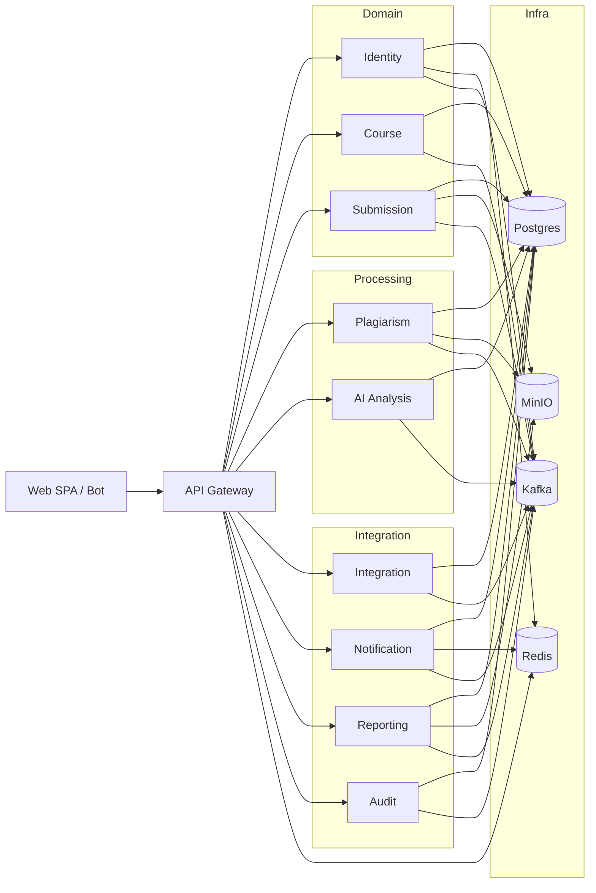

# PlagLens

Multi-tenant plagiarism-detection and LLM-assisted code-review platform
for university CS courses.  PlagLens ingests submissions from Stepik,
Yandex.Contest, Telegram and Google Sheets; orchestrates external
plagiarism engines (JPlag, MOSS, Dolos, Codequiry); runs LLM analysis
against an OpenAI-compatible API; and surfaces the results to teachers
and students through a single FastAPI gateway.

> Status: KT-1 (architecture report). Service implementations are in
> active development; this repository is the source-of-truth for the
> target architecture and the dev tooling.

Architecture is documented in detail in
[`docs/architecture/README.md`](docs/architecture/README.md).
Start there if you want the design rationale; start here if you want
to run the stack.

## Architecture at a glance



Ten services, schema-per-service Postgres, Kafka for events, Redis for
cache + rate-limiting, MinIO for files. See
[`docs/architecture/00-OVERVIEW.md`](docs/architecture/00-OVERVIEW.md)
for the full picture.

## Quickstart

```bash
# 1. Bootstrap (once) — generates JWT keys, copies .env, installs dev tools
make bootstrap

# 2. Edit secrets — at minimum infra/.env.local needs OPENROUTER_API_KEY
#    (and, if you want a working super-admin out of the box, override the
#    BOOTSTRAP_SUPER_ADMIN_PASSWORD in infra/.env).

# 3. Build and run
make build
make up

# 4. Wait ~30s for healthy, then seed demo data
make seed-demo

# 5. Open http://localhost:5173 (frontend, when present) or
#    http://localhost:8000/docs (API). Login as the bootstrap super-admin
#    or as admin@demo.local / admin (demo seed).

# 6. Logs / status
make ps
make logs SERVICE=identity
```

Each microservice container runs its own entrypoint that waits for Postgres
and Redis to be reachable, applies Alembic migrations, optionally bootstraps
the super-admin (Identity only), and then starts uvicorn — so `make up`
brings the stack to a healthy state without manual migration steps.

The gateway listens on `http://localhost:8000` by default.  Open
`http://localhost:8000/healthz` for the aggregated health check,
or `http://localhost:3000` for the bundled Grafana dashboard.

## Common tasks

| Goal                                | Command                                        |
| ----------------------------------- | ---------------------------------------------- |
| Show every Make target              | `make help`                                    |
| Boot the stack                      | `make up` (or `make up-dev` for hot reload)    |
| Tail one service's logs             | `make logs SERVICE=gateway`                    |
| Run all unit tests                  | `make test-all`                                |
| Run one service's tests             | `make test SERVICE=identity`                   |
| Lint everything                     | `make lint-all`                                |
| Format everything                   | `make format-all`                              |
| Type-check everything               | `make typecheck-all`                           |
| Migrate every service               | `make migrate-all`                             |
| Generate a migration                | `make makemigration SERVICE=course MSG="add x"`|
| Seed a tenant + admin               | `python tools/scripts/create-tenant.py …`      |
| Seed demo data                      | `python tools/scripts/create-test-data.py …`   |
| Run e2e smoke tests                 | `make e2e`                                     |
| Tear everything down                | `make down`                                    |
| Wipe volumes (destructive)          | `make reset`                                   |

## Repository layout

```
.
├── docs/architecture/         design docs (KT-1 deliverable)
├── infra/                     docker-compose, prometheus, grafana, traefik
├── libs/plaglens-common/      shared Python lib (errors, observability, rbac)
├── services/                  10 service projects (FastAPI + SQLAlchemy)
│   ├── gateway/    identity/    course/    submission/   integration/
│   ├── plagiarism/ ai-analysis/ notification/ reporting/  audit/
├── tools/
│   ├── e2e/                   pytest end-to-end suite
│   └── scripts/               operator scripts (seed data, health probe)
├── .github/workflows/         CI + release pipelines
├── Makefile
└── README.md (this file)
```

## Contributing

1. Fork or branch from `main`.
2. `make bootstrap` to install pre-commit, ruff, mypy, pytest.
3. Code style: ruff (check + format), mypy on `src/` (strict optional
   off for now). Pre-commit will reject misformatted commits.
4. Tests: every PR must pass `make test-all`. New endpoints get
   coverage in `tools/e2e/`.
5. Migrations: never edit a published Alembic revision; add a new one.
6. Commits: imperative mood, ≤72 chars subject. Reference the relevant
   `docs/architecture/NN-…md` file when introducing or changing a
   contract.
7. PRs to `main` require CI green (per-service ruff + mypy + pytest,
   compose validation, markdownlint).  E2E is best-effort.

## Releases

Tagging `v*` (e.g. `v0.1.0`) on `main` triggers
`.github/workflows/release.yml`, which builds and pushes one Docker
image per service to GHCR (`ghcr.io/<owner>/plaglens/<service>`) and
drafts the GitHub release notes.

## License

MIT — see [`LICENSE`](LICENSE).
