# PlagLens — навигационные диаграммы

> Визуальные представления полных пользовательских путей по 3 ролям: **студент / преподаватель / админ**, плюс общие элементы интерфейса (Topbar, колокольчик уведомлений, user pill, поиск, хоткеи).
>
> Документ организован в **две части**:
>
> 1. **Пользовательское представление** — узлы подписаны так, как видит реальный пользователь («Карточка курса», «Дашборд курса», вкладка «Антиплагиат»). Это «карта приложения для презентации».
> 2. **Техническое представление (Engineering reference)** — те же графы, но узлы подписаны URL-маршрутами (`/courses/:slug/dashboard`, `/admin/audit/actors/:userId`). Используется разработчиками и QA для отладки навигации.
>
> Обе части построены из одних и тех же Mermaid-исходников `docs/diagrams/*.mmd`, отрендеренных в три формата:
> - **SVG** (primary, вектор, 100 % качество при любом zoom — открывайте в браузере или IDE)
> - **PDF** (вектор, для вставки в отчёт КТ-1 / LaTeX / Word)
> - **PNG** (растр, `--scale 3` ≈ 16 500 × 12 000 px — для случаев, где SVG/PDF недоступен)
>
> Текстовая (line-by-line) версия с полными подписями табов и query-параметров: [`NAVIGATION-GRAPHS.md`](./NAVIGATION-GRAPHS.md).

---

## Условные обозначения (легенда)

В диаграммах применены визуальные классы (`classDef` в Mermaid). Тип узла кодируется **цветом и формой** — без иконок и эмодзи.

| Класс | Визуальный стиль | Что означает | Пример (UI / Tech) |
|---|---|---|---|
| `nav` | Светло-зелёный фон, плотная зелёная обводка | Sidebar entry point — главный пункт навигации | «Курсы» / `/courses` |
| `detail` | Кремовый фон, тонкая бежевая обводка | Detail / focused page (карточка ресурса) | «Карточка задания» / `/assignments/:id` |
| `list` | Кремовый фон | List / index view (список как контент таба) | «Список пар» / pair list |
| `modal` | Янтарный фон, тёплая обводка, цилиндр | Modal / overlay (диалог, подтверждение) | «Запуск проверки» / Run modal |
| `form` | Светло-зелёный, dashed-обводка, параллелограмм | Form / wizard (создание ресурса, мастер импорта) | «Мастер импорта» / `/imports` |
| `tab` | Серо-бежевый, dashed-обводка | Tab внутри detail-страницы | вкладка «Файлы» / `tab Files` |
| `pub` | Светлый фон, dashed-обводка, параллелограмм | Public / authless | «Вход» / `/login` |
| `kbd` | Чёрный фон, светлая подпись, dashed-обводка | Горячая клавиша | `g + c · Курсы` |
| `router` | Кремовый фон, красная толстая обводка, ромб | Router / dispatch на основе данных | переход по `action_url` уведомления |
| `page` | Белый фон, плотная зелёная обводка (cross-cutting) | Любой авторизованный экран — точка входа в общие subsystem'ы | узел «Любой авторизованный экран» |

---

# Часть I — Пользовательское представление

> Узлы подписаны человеческими русскими названиями, как видит их реальный пользователь.

## 1. Студент

[](./diagrams/student-ui.svg)

**Источник:** [`student-ui.mmd`](./diagrams/student-ui.mmd) · **PDF:** [`student-ui.pdf`](./diagrams/student-ui.pdf) · **PNG:** [`student-ui.png`](./diagrams/student-ui.png)

Минималистичный sidebar из 4 пунктов («Главная», «Мои задания», «Мои посылки», «Уведомления»). Все пути сходятся к одной центральной сущности — «Моя посылка» с 6 вкладками (Файлы / Оценка / Комментарии / Антиплагиат / AI / История). Самостоятельно настраиваемые разделы (профиль, 2FA, API-ключи, уведомления) собраны в блоке «Самообслуживание».

Самые длинные ветви: `Уведомления → переход → Моя посылка → вкладка AI` — 3 шага от sidebar до контентного таба.

## 2. Преподаватель

[](./diagrams/teacher-ui.svg)

**Источник:** [`teacher-ui.mmd`](./diagrams/teacher-ui.mmd) · **PDF:** [`teacher-ui.pdf`](./diagrams/teacher-ui.pdf) · **PNG:** [`teacher-ui.png`](./diagrams/teacher-ui.png)

Самая богатая роль — два sidebar-блока («Рабочее пространство» и «Инструменты»), полный drill-down: `Курсы → Карточка курса → Карточка ДЗ → Карточка задания → Карточка посылки → Сравнение пары посылок → Шаг по фрагментам`. Между курсом и заданием появился промежуточный уровень **ДЗ (Homework)**: внутри карточки курса теперь «Список ДЗ курса», а сама «Карточка ДЗ» имеет 4 вкладки (Задания / Описание / Дедлайн ДЗ / Статистика ДЗ) и форму «+ Новое задание» под ДЗ. Курс разворачивается в 12 веток (Список ДЗ, Участники, Группы, Приглашения, Статистика, Дашборд, Экспорты, Расписание выгрузок, Google Sheets, Подозрительные, Настройки + создание ДЗ).

«Запуск проверки антиплагиата» — асинхронный: модалка → polling 202 → «Отчёт антиплагиата» с 4 вкладками (Пары / Кластеры / Артефакты / Кросс-курсы).

«AI-отчёт по посылке» имеет 3 действия: «Курировать» (cherry-pick фрагментов в отзыв), «Поделиться со студентом» (toggle), «Перегенерировать».

## 3. Администратор

[](./diagrams/admin-ui.svg)

**Источник:** [`admin-ui.mmd`](./diagrams/admin-ui.mmd) · **PDF:** [`admin-ui.pdf`](./diagrams/admin-ui.pdf) · **PNG:** [`admin-ui.png`](./diagrams/admin-ui.png)

Самая плотная диаграмма — два sidebar-блока («Учреждение», «Система») плюс центральный hub «Обзор» с 8 плитками (Интеграции / Пользователи / Аудит / Провайдеры / Метрики / AI-провайдеры / Бюджеты / Корпус).

«Журнал аудита» имеет 6 направлений drill-down (Поиск / Отказы в доступе / Хранение / Юр. блокировки / По актору / По ресурсу), причём «По актору» возвращает в «Карточку пользователя» — взаимная навигация.

«Уведомления (админ)» — отдельный hub: настройки e-mail (с тестовым письмом через Mailhog), редактируемые шаблоны, список доставок, очередь ошибок (DLQ).

«Провайдеры (объединённые)» — единая страница, объединяющая 7 sub-tiles: LLM, Антиплагиат, E-mail, Telegram, OAuth, Бюджеты, Промпты.

## 4. Общие элементы UI (cross-cutting)

[](./diagrams/cross-cutting-ui.svg)

**Источник:** [`cross-cutting-ui.mmd`](./diagrams/cross-cutting-ui.mmd) · **PDF:** [`cross-cutting-ui.pdf`](./diagrams/cross-cutting-ui.pdf) · **PNG:** [`cross-cutting-ui.png`](./diagrams/cross-cutting-ui.png)

То, что доступно с любого авторизованного экрана независимо от роли. Узел «Любой авторизованный экран» слева — точка входа в 5 общих subsystem'ов:

- **Topbar** (закреплён, 56px) — кнопка «Назад» (на детальных), заголовок страницы, переключатели EN/RU и светлой/тёмной темы. Theme и Lang отмечены как «меняет тему/язык» — показывают side-effects на DOM/storage.
- **Колокольчик уведомлений** (SSE-driven) — счётчик непрочитанных, dropdown «Последние 10», ссылка «Все уведомления». Каждая запись dropdown'a имеет переход (router-узел) на 7 типов карточек (посылка / отчёт антиплагиата / задание / курс / бюджеты / подозрительные / интеграция).
- **User pill** (внизу sidebar) — Меню профиля → Профиль / Настройки интерфейса / Подсказки и хоткеи / Выйти.
- **⌘ K — глобальный поиск** — sidebar search → модалка результатов → переход на курс / задание / посылку / пользователя.
- **Горячие клавиши** (13 hotkey'ев) — `g + c/a/s/d/i/h/o/u/l` для прямой навигации, `⌘ K` для поиска, `?` для подсказок, `Esc` для закрытия модалки, `↑/↓` для шага по фрагментам в diff.

---

# Часть II — Техническое представление (Engineering reference)

> Те же графы с подписями URL-маршрутов и техническими идентификаторами. Используется при отладке навигации и сверке с `routeMap.ts` / Playwright-тестами.

## 1. Студент

[](./diagrams/student.svg)

**Источник:** [`student.mmd`](./diagrams/student.mmd) · **PDF:** [`student.pdf`](./diagrams/student.pdf) · **PNG:** [`student.png`](./diagrams/student.png) · **Текст:** [`NAVIGATION-GRAPHS.md § 1`](./NAVIGATION-GRAPHS.md)

## 2. Преподаватель

[](./diagrams/teacher.svg)

**Источник:** [`teacher.mmd`](./diagrams/teacher.mmd) · **PDF:** [`teacher.pdf`](./diagrams/teacher.pdf) · **PNG:** [`teacher.png`](./diagrams/teacher.png) · **Текст:** [`NAVIGATION-GRAPHS.md § 2`](./NAVIGATION-GRAPHS.md)

## 3. Администратор

[](./diagrams/admin.svg)

**Источник:** [`admin.mmd`](./diagrams/admin.mmd) · **PDF:** [`admin.pdf`](./diagrams/admin.pdf) · **PNG:** [`admin.png`](./diagrams/admin.png) · **Текст:** [`NAVIGATION-GRAPHS.md § 3`](./NAVIGATION-GRAPHS.md)

## 4. Общие элементы UI (cross-cutting)

[](./diagrams/cross-cutting.svg)

**Источник:** [`cross-cutting.mmd`](./diagrams/cross-cutting.mmd) · **PDF:** [`cross-cutting.pdf`](./diagrams/cross-cutting.pdf) · **PNG:** [`cross-cutting.png`](./diagrams/cross-cutting.png) · **Текст:** [`NAVIGATION-GRAPHS.md § 5`](./NAVIGATION-GRAPHS.md)

---

## Как пересобрать диаграммы

Если `*.mmd` файлы изменились, перерендер через `@mermaid-js/mermaid-cli`:

```powershell
# из C:\Projects\PlagLens\docs\diagrams
foreach ($f in 'student','teacher','admin','cross-cutting',
              'student-ui','teacher-ui','admin-ui','cross-cutting-ui') {
  # SVG (вектор, primary в markdown)
  npx --yes @mermaid-js/mermaid-cli -i "$f.mmd" -o "$f.svg" `
    -c config.json -b "#f7f5f1"
  # PDF (вектор, для отчёта / LaTeX / Word)
  npx --yes @mermaid-js/mermaid-cli -i "$f.mmd" -o "$f.pdf" `
    -c config.json -b "#f7f5f1" --pdfFit
  # PNG ультра-DPI (растр-фолбэк)
  npx --yes @mermaid-js/mermaid-cli -i "$f.mmd" -o "$f.png" `
    -c config.json -b "#f7f5f1" -w 5500 -H 4000 --scale 3
}
```

Параметры:
- `-c config.json` — тема (paper-bg `#f7f5f1`, accent green `#3d5b4f`, Plus Jakarta Sans, `nodeSpacing: 60`, `rankSpacing: 100`, `padding: 24`).
- SVG / PDF — вектор, не теряют качество при любом увеличении. **SVG — primary в markdown, PDF — для печатного отчёта КТ-1.**
- PNG — `-w 5500 -H 4000 --scale 3` (фактически ≈ 16 500 × 12 000 px) — для случаев, где SVG/PDF не поддерживается.

---

## Связь с другими документами

| Документ | Содержание |
|---|---|
| [`NAVIGATION-GRAPHS.md`](./NAVIGATION-GRAPHS.md) | 812 строк — текстовые ASCII-tree представления тех же графов с полными подписями вкладок, query-параметров, прав доступа. Авторитетный источник при расхождениях. |
| [`E2E-TEST-REPORT.md`](./E2E-TEST-REPORT.md) | Playwright-результаты — какие пути из этих графов покрыты тестами. |
| [`architecture/`](./architecture/) | Архитектурные решения (RBAC, async-паттерны, провайдеры) — связи между UI-узлами и backend-сервисами. |
| [`screenshots/`](./screenshots/) | Скриншоты ключевых страниц при QA-проходе. |
