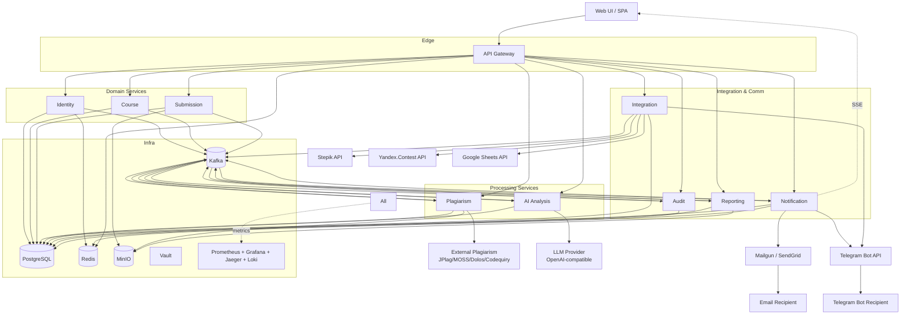

# PlagLens — Architecture Overview

> Документ описывает целевую архитектуру PlagLens на уровне сервисов, инфраструктуры и принципов проектирования API. Деталь по эндпоинтам — в файлах `04-IDENTITY.md` … `13-GATEWAY.md`. Cross-cutting (ошибки, async, RBAC, события) — в `01-CROSS-CUTTING.md`, `02-RBAC.md`, `03-EVENTS.md`.

## 1. Видение

PlagLens — **мультитенантная** платформа автоматизации проверки программных заданий. Целевой масштаб: 1000+ студентов на тенант, поддержка реальной эксплуатации в учебных курсах. Архитектура — **микросервисная**, развёртывание Docker (VPS) сейчас и Kubernetes в перспективе. LLM-провайдер абстрагирован через OpenAI-совместимый протокол, что позволит в будущем заменить внешний API на self-hosted модель (vLLM / llama.cpp / TGI) без изменения кода.

## 2. Сервисная топология (10 сервисов)

| # | Сервис | Назначение | Заменяет/объединяет из КТ-1 |
|---|---|---|---|
| 1 | **API Gateway** | Единственный публичный вход. JWT validation, маршрутизация, rate-limit, CORS, request/response logging | BFF API Gateway |
| 2 | **Identity** | Auth (email+pwd, OAuth, 2FA), пользователи, tenant'ы, RBAC | Auth Service + User Service |
| 3 | **Course** | Курсы, группы, задания, дедлайны, члены курса, приглашения | Course Service + Assignment Service |
| 4 | **Submission** | Посылки (все версии), файлы, оценки, преподавательский фидбек | Часть Assignment Service |
| 5 | **Integration** | Stepik / Я.Контест / Telegram / Google Sheets — pluggable adapters в одном сервисе | Stepik Adapter + Yandex Contest Adapter + Telegram Bot + Google Sheets |
| 6 | **Plagiarism** | Оркестрация внешнего антиплагиата (JPlag/MOSS/Codequiry/Dolos), отчёты, cross-course corpus | Plagiarism Service |
| 7 | **AI Analysis** | LLM через OpenAI-совместимый API, кэш, бюджеты, prompt versioning | AI Analysis Service |
| 8 | **Notification** | События → каналы (in-app SSE / email / Telegram), persistent история | Notification Service |
| 9 | **Reporting** | Exports (CSV/XLSX/JSON/PDF/Sheets) + дашборды + аналитика | Export Service + Dashboard Service |
| 10 | **Audit** | Централизованный аудит-журнал | Audit Log Service |

> Что выкинуто из КТ-1: отдельный BFF (его роль играет API Gateway), отдельный Dashboard Service (внутри Reporting), 4 отдельных integration адаптера (один сервис с pluggable модулями).
> Что добавлено: Submission Service отдельно (объёмы файлов и плотность операций оправдывают отдельный деплой).

## 3. Высокоуровневая диаграмма

(Стрелки от All — упрощение: каждый сервис экспортит метрики, логи и спаны.)

## 4. Технологический стек

| Слой | Технология |
|---|---|
| Язык backend | Python 3.12+ |
| Web framework | FastAPI |
| ORM / migrations | SQLAlchemy 2.x + Alembic |
| Async tasks | Celery + Redis broker |
| Inter-service messaging | Kafka (события) + HTTP/REST (синхронные вызовы между сервисами) |
| Schema validation | Pydantic v2 |
| Frontend | React 18+ SPA, TypeScript, Vite |
| Database | PostgreSQL 16, schema-per-service |
| Cache & broker | Redis 7 |
| Object storage | MinIO (S3-compatible) |
| Email | Mailgun / SendGrid (transactional API) |
| Telegram | aiogram (бот) + Telegram Bot API |
| LLM client | openai-python SDK (совместимый протокол) |
| Plagiarism adapters | jplag (Java subprocess), Dolos CLI, MOSS perl-protocol client, Codequiry HTTP |
| Edge proxy / TLS | Traefik (Docker) → Ingress NGINX (k8s) |
| Service mesh (k8s) | роадмап: Linkerd / Istio |
| Secrets | HashiCorp Vault |
| Metrics | Prometheus, exporter в каждом сервисе |
| Dashboards | Grafana |
| Tracing | OpenTelemetry SDK → Jaeger |
| Logs | structlog → Loki |
| Auth | OAuth2 / OIDC, JWT (RS256), refresh в httpOnly cookie |

## 5. Развёртывание

### Этап 1 — VPS / Docker Compose
- Один или два VPS, всё в Docker Compose: 10 сервисных контейнеров + Postgres + Redis + Kafka (single-broker) + MinIO + Prometheus + Grafana + Jaeger + Vault + Traefik
- Health/readiness checks, автоматический рестарт (`restart: unless-stopped`)
- TLS — Let's Encrypt через Traefik
- Backup nightly: pg_dump + MinIO snapshot

### Этап 2 — Kubernetes
- 10 deployments + соответствующие services + ingress + cert-manager
- Postgres → managed (RDS-аналог) или Patroni-кластер
- Kafka → managed (Aiven / Yandex Managed Kafka) или Strimzi-оператор
- HPA на основе CPU + RPS (через Prometheus adapter)
- Service mesh для mTLS, retries, circuit breakers

## 6. Принципы

1. **Single endpoint, server-side RBAC.** Никаких `/teacher/...` vs `/student/...`. Один эндпоинт, фильтрация и проверка прав на бэкенде.
2. **Flat-with-context URLs.** `/v1/submissions/{id}` для lookup; `/v1/courses/{id}/submissions` для коллекций. Максимум один уровень вложения.
3. **Async по умолчанию для всего тяжёлого.** Импорт, проверка плагиата, LLM, экспорт — через Operation resource (Canvas pattern).
4. **Provider-agnostic интеграции.** Plagiarism и LLM — pluggable adapters за общим интерфейсом. Можно сменить провайдера без изменения публичного API.
5. **Event-driven между сервисами.** Domain events публикуются в Kafka. Synchronous HTTP — только для read-cross-service когда event не подходит.
6. **Идемпотентность всех write-операций.** `Idempotency-Key` header клиентам, идемпотентные consumer'ы для Kafka.
7. **Tenant isolation на каждом запросе.** Все запросы фильтруются по `tenant_id` от JWT, на уровне репозитория, не контроллера.
8. **Soft delete + retention period.** Жёсткое удаление — только GDPR-эндпоинт с экспресс-запросом.
9. **Observability First.** Каждый запрос имеет `trace_id`, каждый bg-job имеет `job_id`; они coррелируются в логах, метриках, спанах.
10. **Schema migration безопасны.** Только additive changes между релизами; деструктивные — через двухфазный deploy.

## 7. Roadmap соответствие КТ-1 §9

| Неделя | Что добавляется (по КТ-1) | На каких сервисах PlagLens отражается |
|---|---|---|
| 1–2 | Каркас, миграции, очереди | Все сервисы — bootstrap, Postgres, Redis, Kafka, Operation pattern |
| 3–4 | JWT, профили, RBAC, CRUD курсов/заданий | Identity + Course |
| 5–6 | Импорт, дедуп, идемпотентность | Integration + Submission |
| 7–8 | Антиплагиат | Plagiarism + Reporting (часть отчётов) |
| 9–10 | LLM | AI Analysis |
| 11–12 | Кабинет преподавателя | Course + Submission + Reporting + Plagiarism + AI views |
| 13–14 | Кабинет студента + аудит | Submission + Identity (видимость) + Audit |
| 15–20 | Экспорт, дашборды, observability, стабилизация | Reporting + cross-cutting + ops |

## 8. Связанные документы

- [`01-CROSS-CUTTING.md`](./01-CROSS-CUTTING.md) — общие соглашения API: ошибки, пагинация, async-операции, идемпотентность, версионирование
- [`02-RBAC.md`](./02-RBAC.md) — роли, разрешения, изоляция тенантов
- [`03-EVENTS.md`](./03-EVENTS.md) — Kafka-топики, событийная модель, контракты событий
- [`04-IDENTITY.md`](./04-IDENTITY.md) — Identity Service (auth, users, tenants, OAuth)
- [`05-COURSE.md`](./05-COURSE.md) — Course Service (курсы, группы, задания)
- [`06-SUBMISSION.md`](./06-SUBMISSION.md) — Submission Service (посылки, файлы, оценки)
- [`07-INTEGRATION.md`](./07-INTEGRATION.md) — Integration Service (Stepik, Я.Контест, Telegram, Google Sheets, webhooks)
- [`08-PLAGIARISM.md`](./08-PLAGIARISM.md) — Plagiarism Service
- [`09-AI-ANALYSIS.md`](./09-AI-ANALYSIS.md) — AI Analysis Service
- [`10-NOTIFICATION.md`](./10-NOTIFICATION.md) — Notification Service
- [`11-REPORTING.md`](./11-REPORTING.md) — Reporting Service
- [`12-AUDIT.md`](./12-AUDIT.md) — Audit Service
- [`13-GATEWAY.md`](./13-GATEWAY.md) — API Gateway endpoints
